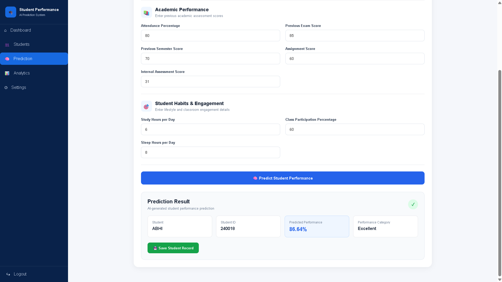
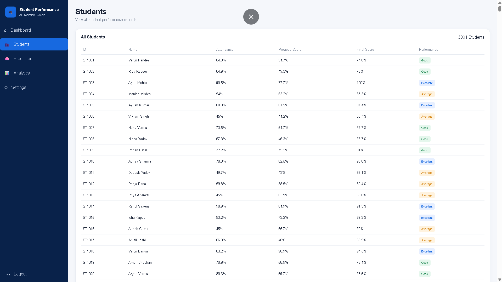
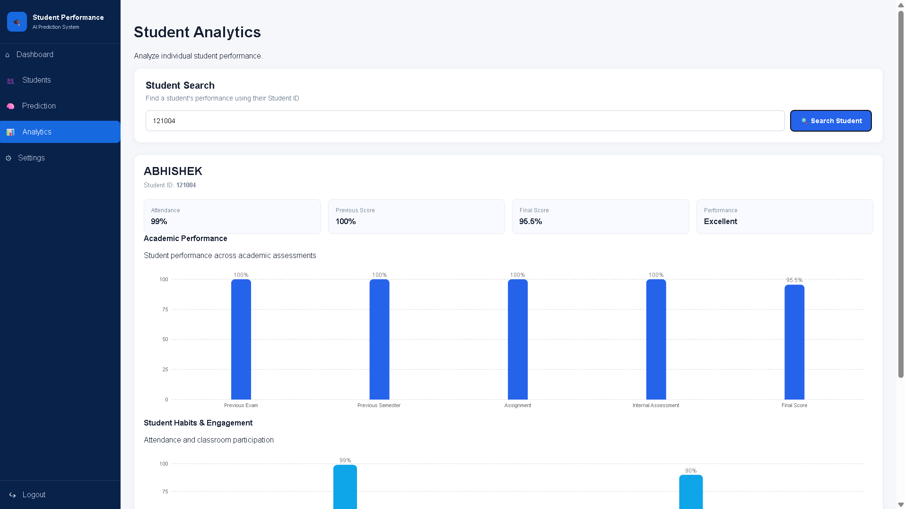
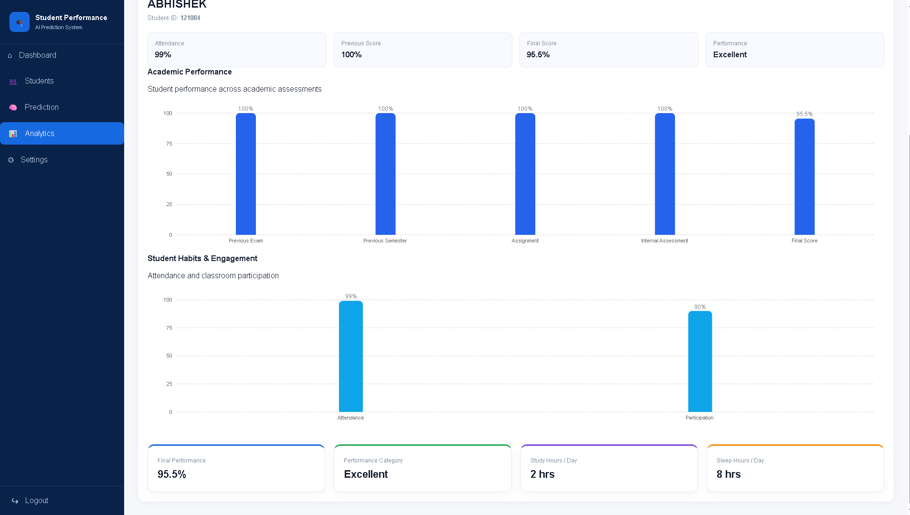
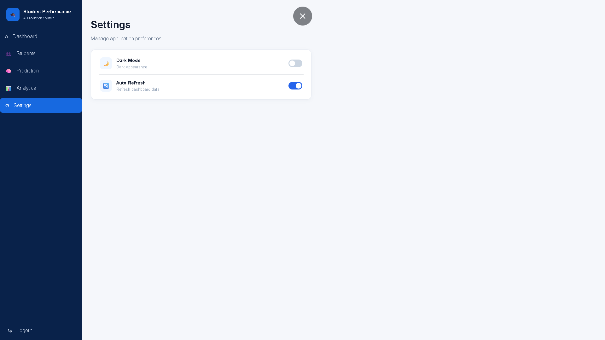

# 🎓 Student Performance AI

An AI-powered student performance prediction and analytics system that helps analyze academic performance and predict a student's final performance score based on multiple academic and behavioral factors.

## 📌 Project Overview

Student Performance AI is a web-based application designed to analyze student performance and provide AI-based predictions.

The system takes important student factors such as attendance, previous examination scores, assignments, internal assessment, study hours, class participation, and sleep hours to predict the student's final performance.

The application also provides a dashboard for viewing student statistics and individual performance analytics.

## ✨ Features

- 📊 Interactive student performance dashboard
- 🧠 AI-based student performance prediction
- 👥 Student records management
- 📈 Individual student analytics
- 📚 Academic performance analysis
- 🎯 Student habits and engagement analysis
- 📋 Performance categories:
  - Excellent
  - Good
  - Average
  - Needs Improvement
- 🔄 Automatic dashboard data refresh
- ⚙️ Simple settings panel
- 📱 Responsive user interface

## 🛠️ Technology Stack

### Frontend
- React
- Vite
- JavaScript
- CSS
- Recharts

### Backend
- Python
- Flask
- Flask-CORS

### Machine Learning & Data
- Scikit-learn
- Pandas
- Joblib
- CSV Dataset
- Trained Machine Learning Model

## 📂 Project Structure

```text
student-performance-ai/
│
├── ml/
│   ├── app.py
│   ├── train_model.py
│   ├── student_performance_3000.csv
│   └── student_performance_model.pkl
│
├── public/
│
├── src/
│   ├── App.jsx
│   ├── App.css
│   ├── index.css
│   └── main.jsx
│
├── package.json
├── package-lock.json
├── vite.config.js
├── eslint.config.js
├── index.html
└── README.md
```


## 📊 Prediction Factors

The machine learning model uses the following student features:

- Attendance Percentage
- Previous Exam Score
- Previous Semester Score
- Assignment Score
- Internal Assessment Score
- Study Hours per Day
- Class Participation Percentage
- Sleep Hours per Day

## 🎯 Performance Categories
| Score    | Category          |
| -------- | ----------------- |
| 85–100   | Excellent         |
| 70–84    | Good              |
| 50–69    | Average           |
| Below 50 | Needs Improvement |


## 📸 Screenshots

### 1. Dashboard


### 2. Student Prediction


### 3. Student Prediction Result


### 4. Students


### 5. Student Analytics


### 6. Analytics Result


### 7. Settings
